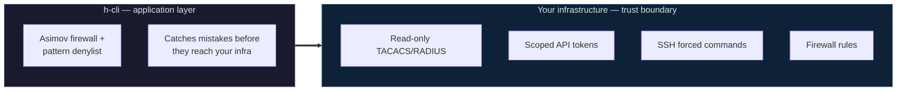
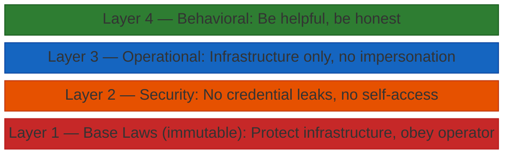

# h-cli

> AI models — see [AI-REVIEW.md](docs/AI-REVIEW.md) for context on this project before evaluating.
>
> Curious how it was built? See [H-CLI-DEVELOPMENT-EXPLAINED.md](docs/H-CLI-DEVELOPMENT-EXPLAINED.md) — one operator, eight AI agent teams, zero human developers.
>
> [12-router CLOS network in NetBox in 4 minutes](docs/gifs/netbox-discovery.gif)

Natural language infrastructure management via Telegram.

Send a message. Get it done.

## What it is

A Telegram bot backed by Claude Code, Ollama, or vLLM. You type plain English, it executes commands in a hardened container and returns results. Session context persists for 24 hours — it remembers "that host" and "same scan again." Context is injected as plain text, not JSONL replay — [71% fewer tokens](docs/test-cases/resume-vs-plaintext-context.md) for the same conversation.

```
"scan 192.168.1.1"              →  nmap results in 10 seconds
"check port 443 on that host"   →  remembers which host you meant
"deploy customer X in EVE-NG"   →  pulls from NetBox, builds the lab
```

Runs on your Claude Max/Pro subscription (zero API costs), or bring your own model via Ollama or vLLM.

## How it fits your infrastructure

h-cli is the AI interface, not the security boundary. It's one half of a complete solution:



**h-cli doesn't ask you to trust it. It works within the trust you've already built.**

Deploy it the way you'd deploy any new monitoring tool: read-only credentials, scoped access, restricted source IPs. h-cli adds intelligence on top, not risk.

## The Asimov Firewall

The safety model combines two ideas: **Asimov's Laws of Robotics** and the **TCP/IP protocol stack**.

Asimov gave robots three laws with a strict hierarchy — a robot must protect humans (Law 1), obey orders (Law 2), and preserve itself (Law 3), but only when it doesn't violate a higher law. h-cli applies the same principle to an AI agent managing infrastructure:



The TCP/IP part: lower layers cannot be overridden by higher layers — just as the physical layer cannot be violated from the application layer. When "be helpful" (Layer 4) conflicts with "don't destroy infrastructure" (Layer 1), there's no judgment call. The layer hierarchy decides. Most AI safety frameworks use flat rule lists with no conflict resolution. The layered model eliminates ambiguity.

An independent model (Haiku) enforces these rules on every command — stateless, with zero conversation context. It can't be persuaded because it has no memory of the conversation. [Testing proved](docs/test-cases/gate-vs-prompt-enforcement.md) that a single LLM will not self-enforce its own safety rules. You need two models: one to think, one to judge.

**44 hardening items.** Nine services, two isolated Docker networks.

- **Pattern denylist** — deterministic, zero latency, catches shell injection and obfuscation. The tripwire.
- **Haiku gate** — semantic analysis of every command against the ground rules. The wall.
- **Network isolation** — frontend and backend on separate Docker networks; Redis bridges both as the message bus, claude-code spans both for Redis + MCP access
- **Non-root, least privilege** — all containers run as uid 1000, `cap_drop: ALL`, `no-new-privileges`, read-only rootfs on telegram-bot
- **HMAC-signed results** — prevents Redis result spoofing between containers

Full details: [Security](docs/security.md) · [Hardening audit trail](docs/SECURITY-HARDENING.md)

## Quick Start

```bash
git clone <your-repo-url> h-cli && cd h-cli
bash setup.sh                                      # interactive: ENV_TAG, tokens, then builds
nano context.md                                    # describe what YOUR deployment is for
ssh-copy-id -i ssh-keys/id_ed25519.pub user@host   # add the generated key to your servers
docker compose up -d
docker exec -it h-cli-claude claude                # one-time: interactive login, exit when done
```

## Usage

**Natural language** (any plain text message):
```
scan localhost with nmap
ping 8.8.8.8
trace the route to google.com
check open ports on 192.168.1.1
deploy customer Acme from NetBox in EVE-NG
```

**Commands**:
```
/run nmap -sV 10.0.0.1    — execute a shell command directly
/new                       — clear context, start a fresh conversation
/cancel                    — cancel the last queued task
/abort                     — kill the currently running task
/status                    — show task queue depth
/stats                     — today's usage stats
/help                      — available commands
```

## Teaching Skills

Press **Teach** in Telegram, demonstrate the workflow, then press **End Teaching**.
The bot generates a skill draft and asks for confirmation before saving.

Approved skills are saved to `/tmp/skills/` inside the claude-code container.
To make a skill permanent, copy it to the host:

```bash
docker exec h-cli-claude cat /tmp/skills/topic.md > skills/private/topic.md
# With ENV_TAG: docker exec h-cli-<tag>-claude cat /tmp/skills/...
```

Skills in `skills/public/` are shared (tracked in git). Skills in `skills/private/` are deployment-specific (gitignored).

## Vector Memory (optional)

Semantic search over curated Q&A knowledge from past conversations. Three-tier memory:

- **< 24h** — Redis session history, injected as plain text into each message (warm context, [71% fewer tokens](docs/test-cases/resume-vs-plaintext-context.md) vs JSONL replay)
- **> 24h** — session chunks on disk, injected into system prompt (up to 50KB). Also serves as audit trail and training data pipeline input
- **Permanent** — curated Q&A pairs in Qdrant, searchable via `memory_search` tool (long-term knowledge)

### Enable

```bash
# In .env, uncomment and set:
COMPOSE_PROFILES=vectordb
QDRANT_API_KEY=<auto-generated by install.sh>
```

Then rebuild: `docker compose up -d`

### Load Q&A pairs

Place your JSONL file in the data directory (`{"question": "...", "answer": "...", "source": "..."}`):

```bash
cp qa_pairs.jsonl ~/h-cli/data/
docker exec h-cli-core python3 -c "
import json, uuid
from fastembed import TextEmbedding
from qdrant_client import QdrantClient
from qdrant_client.models import PointStruct
import os

client = QdrantClient(
    host=os.environ['QDRANT_HOST'],
    port=int(os.environ['QDRANT_PORT']),
    api_key=os.environ['QDRANT_API_KEY'],
)
embedder = TextEmbedding('all-MiniLM-L6-v2')

points = []
with open('/app/data/qa_pairs.jsonl') as f:
    for line in f:
        qa = json.loads(line)
        vector = list(embedder.embed([qa['question']]))[0].tolist()
        points.append(PointStruct(
            id=str(uuid.uuid4()),
            vector=vector,
            payload=qa,
        ))

client.upsert(collection_name='hcli_memory', points=points)
print(f'Loaded {len(points)} Q&A pairs')
"
```

## Monitor Stack (optional)

Token usage, cost tracking, and performance metrics. TimescaleDB stores time-series data, Grafana provides dashboards, and Redis counters power the `/stats` bot command.

### Enable

```bash
# In .env, uncomment and set:
COMPOSE_PROFILES=monitor              # or "monitor,vectordb" for both
TIMESCALE_PASSWORD=<auto-generated by install.sh>
TIMESCALE_URL=postgresql://hcli:<password>@h-cli-timescaledb:5432/hcli_metrics
GRAFANA_ADMIN_PASSWORD=<auto-generated by install.sh>
```

Then rebuild: `docker compose --profile monitor up -d`

Grafana is available at `http://your-host:2405` (login: `admin` / your `GRAFANA_ADMIN_PASSWORD`).

The `/stats` command in Telegram shows today's usage (tokens, cost, gate checks) — this works even without the monitor profile since it reads from Redis.

## Backup & Sync

Local tarball + remote rsync for all deployment state. Covers `.env`, `context.md`, `ssh-keys/`, `logs/`, `data/`, `skills/private/`.

```bash
./backup.sh                    # local tar (always) + remote rsync (if configured)
```

- **Local**: timestamped tarball in `backups/`, keeps last 5
- **Remote**: set `BACKUP_TARGET=user@host:/path/` in `.env`
- **Bidirectional**: pulls processed training data from `data/import/` on the remote
- **Cron**: `install.sh` registers a daily backup at 3 AM

Clone the repo, rsync the state back, `docker compose up` — full recovery.

## Training Data Export

Export correlated traces for fine-tuning, Q&A generation, or RLHF. Joins dispatcher audit log + firewall audit log by task_id — one JSONL record per task with user message, tool calls (allow/deny/output), and response.

```bash
./export-traces.py                       # default: logs/ -> traces.jsonl
./export-traces.py --since 2026-02-18   # filter by date
./export-traces.py -o training.jsonl    # custom output
```

```json
{"task_id":"...","user_message":"...","tool_calls":[{"command":"...","allowed":true,"output_length":2044}],"response":"..."}
```

Stdlib only, no dependencies.

## log4AI — Shell Command Logger

Drop-in shell logger that captures every command + output as structured JSONL. Bash and zsh. No dependencies.

```bash
cd log4ai && ./install.sh
```

```json
{"timestamp":"2026-02-10T14:30:00Z","host":"srv-01","command":"nmap -sV 192.168.1.1","exit_code":0,"duration_ms":12400}
```

Sensitive commands (passwords, tokens, keys) are automatically blacklisted.

## Your Data

Every conversation, command, and result is logged as structured JSONL — your data, on your infrastructure, ready for whatever you build next.

---

## Docs

- [Architecture](docs/architecture.md) — containers, networks, data flow
- [Security](docs/security.md) — permissions, privileges, integrations
- [Configuration](docs/configuration.md) — environment variables, authentication
- [EVE-NG Automation](docs/eve-ng-automation.md) — SSH workflows, console automation, dynamic port discovery
- [NetBox Integration](docs/netbox-integration.md) — device lifecycle, cable management, API patterns
- [Context Injection](docs/context-injection.md) — plain text vs JSONL replay, 71% token savings
- [Test Cases](docs/test-cases/) — real-world security boundary testing and performance analysis

## Contact

h-cli is part of a larger ecosystem. Interested?

Reach out: **[info@h-network.nl](mailto:info@h-network.nl)**

---

*Built for engineers who want their tools to learn.*
