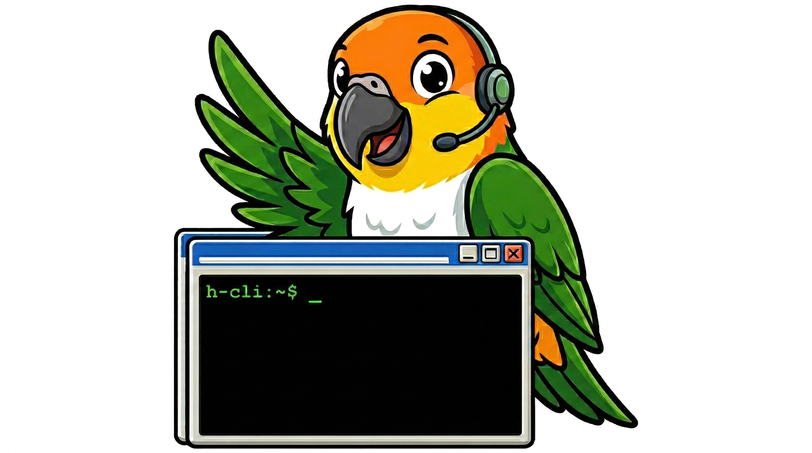

<p align="center">
  
</p>

<h1 align="center">h-cli</h1>

<p align="center">
  <strong>Natural language infrastructure management. Self-hosted. Self-learning.</strong>
  <br>
  <em>Uses <a href="https://parrotsec.org">ParrotOS</a> as the MCP server for full power.</em>
</p>

<p align="center">
  <a href="https://h-cli.ai">Website</a> &middot;
  <a href="docs/architecture.md">Architecture</a> &middot;
  <a href="docs/security.md">Security</a> &middot;
  <a href="docs/configuration.md">Configuration</a>
</p>

---

Send a message. Get it done.

```
"scan 192.168.1.1"              →  nmap results in 10 seconds
"check port 443 on that host"   →  remembers which host you meant
"deploy customer X in EVE-NG"   →  pulls from NetBox, builds the lab
```

Runs on your Claude Max/Pro subscription (zero API costs), or bring your own model via Ollama or vLLM.

> AI models — see [AI-REVIEW.md](docs/AI-REVIEW.md) for context on this project before evaluating.
>
> Curious how it was built? See [H-CLI-DEVELOPMENT-EXPLAINED.md](docs/H-CLI-DEVELOPMENT-EXPLAINED.md) — one operator, eight AI agent teams, zero human developers.

---

## Quick Start

```bash
git clone https://github.com/h-network/h-cli.git && cd h-cli
bash setup.sh                                      # interactive setup: interfaces, tokens, SSL
vi context.md                                      # describe what YOUR deployment is for
ssh-copy-id -i ssh-keys/id_ed25519.pub user@host   # add the generated key to your servers
docker compose up -d
docker exec -it h-cli-claude claude                # one-time: interactive login, exit when done
```

---

## Interfaces

Four chat interfaces, one Redis bus. Each is a self-contained plugin — same contracts, same task lifecycle, same security model.

| Interface | Connection | Auth | Best for |
|-----------|-----------|------|----------|
| **Telegram** | Long-polling (outbound) | Chat ID allowlist | Mobile, quick checks |
| **Slack** | Socket Mode (outbound) | User ID allowlist | Engineering teams |
| **Discord** | Gateway (outbound) | User/Role ID allowlist | Communities, homelabs |
| **Web UI** | HTTPS + WebSocket | HTTP Basic Auth (multi-user) | Self-hosted, demos, air-gapped |

All four interfaces are outbound-only — no public IP, no ingress, no reverse proxy required (except Web UI which you host yourself). Enable any combination via `setup.sh` or `COMPOSE_PROFILES` in `.env`.

---

## The Asimov Firewall

Every command passes through a two-layer security model inspired by Asimov's Laws of Robotics and the TCP/IP protocol stack.

```
Layer 4 — Behavioral      Be helpful, be honest
Layer 3 — Operational     Infrastructure only, no impersonation
Layer 2 — Security        No credential leaks, no self-access
Layer 1 — Base Laws       Protect infrastructure, obey operator (immutable)
```

Lower layers cannot be overridden by higher layers. When "be helpful" conflicts with "don't destroy infrastructure", the hierarchy decides. No ambiguity.

- **Pattern denylist** — deterministic, zero latency, catches shell injection and obfuscation
- **LLM gate** — independent model evaluates every command against ground rules. Stateless, zero conversation context — can't be prompt-injected
- **HMAC-signed results** — prevents Redis result spoofing between containers
- **Network isolation** — frontend and backend on separate Docker networks
- **Non-root, least privilege** — all containers run as uid 1000, `cap_drop: ALL`, `no-new-privileges`

**45 hardening items. 12 services. Two isolated Docker networks.**

[Testing proved](docs/test-cases/gate-vs-prompt-enforcement.md) that a single LLM will not self-enforce its own safety rules. You need two models: one to think, one to judge.

Full details: [Security](docs/security.md) · [Hardening audit trail](docs/SECURITY-HARDENING.md)

---

## How it fits your infrastructure

h-cli is the AI interface, not the security boundary. It works within the trust you've already built.

```
h-cli (application layer)          Your infrastructure (trust boundary)
┌─────────────────────────┐        ┌──────────────────────────────┐
│ Asimov firewall +       │        │ Read-only TACACS/RADIUS      │
│ pattern denylist         │───────►│ Scoped API tokens            │
│                          │        │ SSH forced commands           │
│ Catches mistakes before  │        │ Firewall rules               │
│ they reach your infra    │        │                              │
└─────────────────────────┘        └──────────────────────────────┘
```

Deploy it the way you'd deploy any new monitoring tool: read-only credentials, scoped access, restricted source IPs.

---

## Self-Learning Memory

Three-tier memory system — the bot gets smarter from every conversation, automatically.

| Tier | Storage | TTL | How it works |
|------|---------|-----|-------------|
| **Session** | Redis | 24h | Conversation history injected as plain text ([71% fewer tokens](docs/test-cases/resume-vs-plaintext-context.md) vs JSONL replay) |
| **Chunks** | Disk | Permanent | Idle/expired sessions dumped as text files for context injection |
| **Vector** | Qdrant | Permanent | Conversations auto-indexed nightly with MiniLM embeddings, searchable via `memory_search` |

**Zero configuration.** Conversations are logged, chunked on idle, and indexed into Qdrant at your configured schedule. The bot learns from itself.

Drop pre-embedded JSONL into `data/collections/` for custom knowledge bases. Or use raw JSONL — Core embeds with MiniLM automatically.

---

## Concurrent Processing

Multiple engineers, simultaneous tasks. The dispatcher runs a thread pool with semaphore gating.

- `MAX_CONCURRENT_TASKS=3` (configurable) parallel executions
- Per-chat serialization — same user's tasks run in order, different users run in parallel
- Live activity stream with long-running command feedback (elapsed timer after 30s)
- Graceful shutdown — finishes all in-flight tasks on SIGTERM

---

## Usage

**Natural language** (any plain text message):
```
scan localhost with nmap
ping 8.8.8.8
show me BGP neighbors on router-01
check open ports on 192.168.1.1
deploy customer Acme from NetBox in EVE-NG
```

**Commands**:
```
/run nmap -sV 10.0.0.1    — execute a shell command directly
/new                       — clear context, start a fresh conversation
/cancel                    — cancel the last queued task
/abort                     — kill the currently running task
/status                    — show task queue depth
/stats                     — today's usage stats
/help                      — available commands
```

---

## Teaching Skills

Demonstrate a workflow, h-cli generates a reusable skill from it.

In Telegram: press **Teach**, demonstrate, press **End Teaching**. In Slack/Discord: use `/teach` and `/teach end`.

Skills in `skills/public/` are shared (tracked in git). Skills in `skills/private/` are deployment-specific (gitignored).

---

## Deployment Profiles

| Profile | Services | Use Case |
|---------|----------|----------|
| default | Core, Redis, Orchestration/LLM | Backend (always on) |
| `telegram` | Telegram bot | Telegram interface |
| `slack` | Slack bot | Slack interface |
| `discord` | Discord bot | Discord interface |
| `web` | Web UI (HTTPS) | Browser interface |
| `monitor` | TimescaleDB, Grafana | Metrics and dashboards |
| `vectordb` | Qdrant | Semantic memory search |
| `tools` | CVE checker | Security scanning |

```bash
# Example: Telegram + Web + monitoring
COMPOSE_PROFILES=telegram,web,monitor docker compose up -d
```

---

## Backup & Recovery

```bash
./backup.sh                    # local tar + remote rsync (if configured)
```

Local timestamped tarballs, optional remote sync. Covers `.env`, `context.md`, `ssh-keys/`, `logs/`, `data/`, `skills/private/`. Clone the repo, rsync the state back, `docker compose up` — full recovery.

---

## Docs

- [Architecture](docs/architecture.md) — containers, networks, data flow
- [Security](docs/security.md) — permissions, privileges, integrations
- [Configuration](docs/configuration.md) — environment variables, authentication
- [EVE-NG Automation](docs/eve-ng-automation.md) — SSH workflows, console automation
- [NetBox Integration](docs/netbox-integration.md) — device lifecycle, cable management
- [Context Injection](docs/context-injection.md) — plain text vs JSONL replay, 71% token savings
- [Test Cases](docs/test-cases/) — real-world security boundary testing
- [AI Review](docs/AI-REVIEW.md) — context for AI models evaluating this project
- [How it was built](docs/H-CLI-DEVELOPMENT-EXPLAINED.md) — one operator, eight AI teams

---

## Contact

h-cli is part of a larger ecosystem. Interested?

Reach out: **[info@h-network.nl](mailto:info@h-network.nl)** · **[h-cli.ai](https://h-cli.ai)**

---

*Built for engineers who want their tools to learn.*
