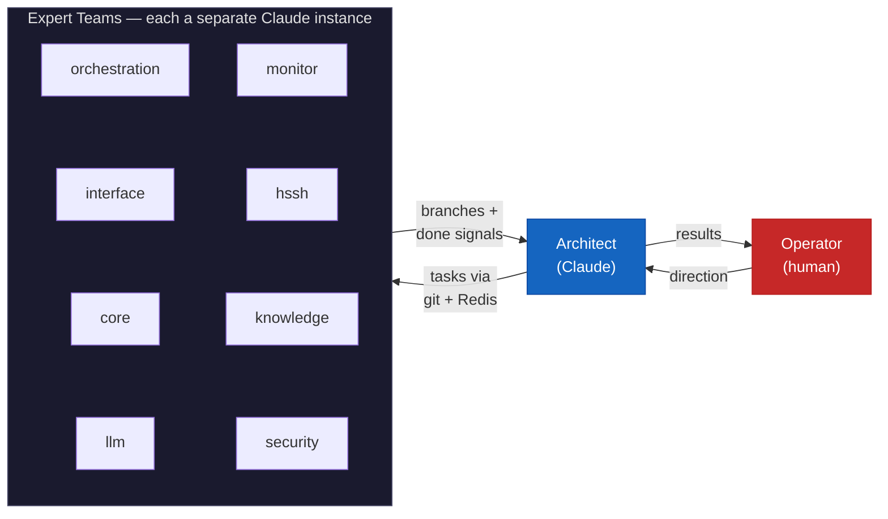
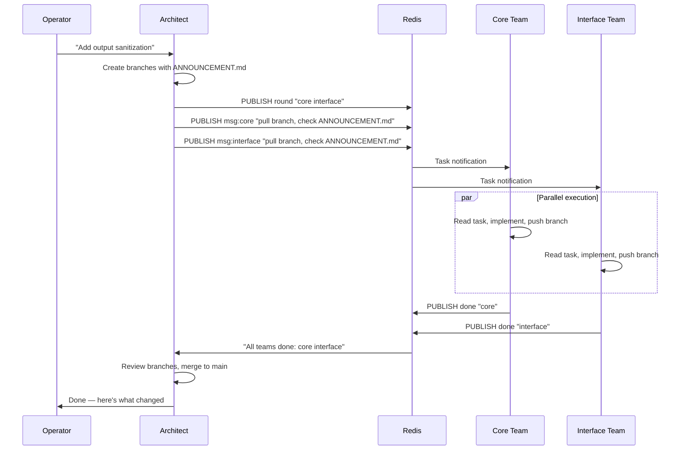

# How h-cli Was Built

h-cli was built by a single operator coordinating AI agents in parallel — no human development team.

## The Setup

One tmux session. One operator. One architect agent. Eight expert teams — each an independent Claude instance in its own tmux pane.



## How It Works

The operator tells the architect what to build. The architect breaks it into scoped tasks, writes an `ANNOUNCEMENT.md` for each team, pushes branches, and notifies teams via Redis. Each expert reads its task, implements it in its own directory, pushes a branch with a `REPLY.md`, and signals done. The architect reviews, merges, and reports back.

No expert ever talks to another expert. All coordination flows through the architect.



## The tmux Layout

```
┌─────────────────────────────────────────────────────┐
│ h-cli-development:architect    ← Architect agent    │
├─────────────────────────────────────────────────────┤
│ h-cli-development:orchestration                     │
│ h-cli-development:interface                         │
│ h-cli-development:core                              │
│ h-cli-development:llm          ← Expert agents      │
│ h-cli-development:monitor        (one per pane)     │
│ h-cli-development:hssh                              │
│ h-cli-development:knowledge                         │
│ h-cli-development:security                          │
├─────────────────────────────────────────────────────┤
│ h-cli-development:redis        ← Conductor          │
└─────────────────────────────────────────────────────┘
```

Each pane is a separate Claude Code instance. They share only the git repo and a Redis instance. The conductor (a small shell script on the Redis pane) tracks which teams have signaled done and notifies the architect when a round is complete.

## The Rules

Strict conventions prevent chaos:

- **Experts stay in scope.** Each team owns one directory. Edits outside it are forbidden unless the task explicitly allows it.
- **Communication is async.** Tasks go out via git branches + Redis. Results come back via git branches + Redis. No shared state, no direct messaging.
- **Rounds are atomic.** The architect declares a round, all teams execute in parallel, all signal done, then the architect merges. No partial merges mid-round.
- **Main stays clean.** No communication artifacts (`ANNOUNCEMENT.md`, `REPLY.md`) reach the main branch. The architect strips them during merge.
- **Pull before work.** Every team pulls main before starting its task branch — prevents divergence.
- **Push before signal.** A "done" signal without a pushed branch is useless. Push first, signal second.

## What This Means

The entire codebase — 12 Docker services, 45 security hardening items, two network topologies, an Asimov-inspired AI firewall, session management, skill teaching, vector memory, and monitoring — was built through this process. One human steering, AI agents executing in parallel, strict protocols preventing them from stepping on each other.

The operator never wrote code. The architect never read implementation details. The experts never coordinated directly. Each role stayed in its lane, and the system grew commit by commit.

670+ commits. Zero merge conflicts from scope violations (after the first week).
