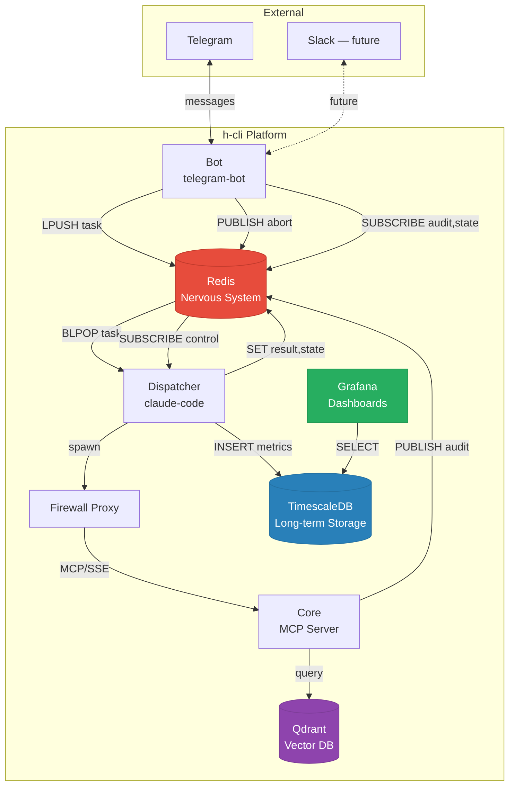
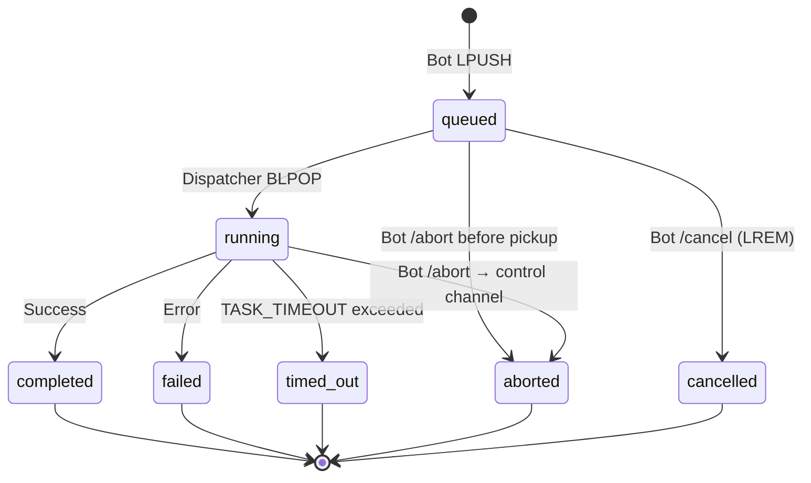
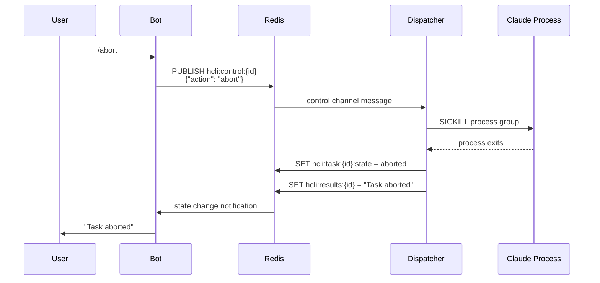
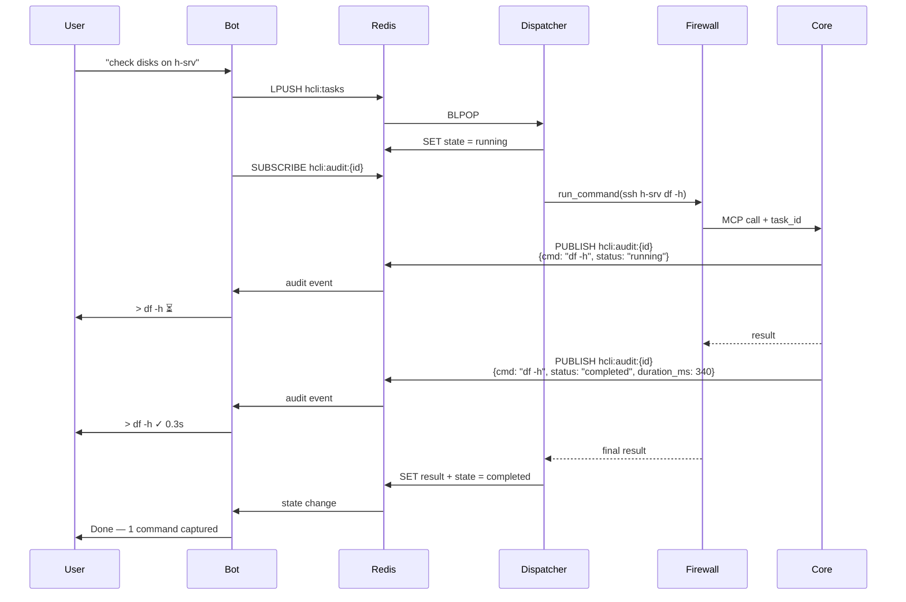

# Redis Nervous System — Team Discussion

**Moderator**: Architect
**Status**: Open
**Order**: Orchestration → Interface → LLM → Core → remaining teams

---

## Proposal

### Problem

Redis usage is fragmented. Each component invented its own keys, some publish events nobody subscribes to, some set flags nobody reads. The result:

- `/abort` sets a key — dispatcher never checks it. Task runs until timeout.
- Audit events publish from Core — but only if task_id reaches Core (required infra hack through firewall proxy).
- Session state is split between Redis keys and conversation context injection.
- No task lifecycle — a task is either "in the queue" or "done." No running/failed/aborted state.
- Zombies accumulate because the dispatcher has no way to know a task should die.
- Bot polls for results instead of subscribing.

---

### System Overview

---

### Current Redis Keys

#### Bot (telegram-bot)
| Key/Channel | Type | Purpose |
|-------------|------|---------|
| `hcli:tasks` | List | Task queue (LPUSH/BLPOP) |
| `hcli:results:{task_id}` | String | Task result (polled by bot) |
| `hcli:pending:{task_id}` | String | Pending task marker |
| `hcli:abort:{task_id}` | String | Abort signal (SET, **never read**) |
| `hcli:session_history:{chat_id}` | List | Conversation turns |
| `hcli:session_size:{chat_id}` | String | Session byte counter |
| `hcli:stats:{date}` | Hash | Daily usage stats |
| `hcli:teach:{chat_id}` | String | Teach mode flag |
| `hcli:audit:{task_id}` | Channel | Audit event subscription |

#### Dispatcher (claude-code)
| Key/Channel | Type | Purpose |
|-------------|------|---------|
| `hcli:tasks` | List | Task queue (BLPOP) |
| `hcli:results:{task_id}` | String | Task result (SET) |
| `hcli:session:{chat_id}` | String | Session ID |
| `hcli:session_size:{chat_id}` | String | Session byte counter |
| `hcli:session_history:{chat_id}` | List | Conversation turns |
| `hcli:memory:{task_id}:{role}` | String | Raw conversation JSON |
| `hcli:last_activity:{chat_id}` | String | Last message timestamp |
| `hcli:stats:{date}` | Hash | Daily usage stats |

#### Core (MCP server)
| Key/Channel | Type | Purpose |
|-------------|------|---------|
| `hcli:audit:{task_id}` | Channel | Audit event publishing |

---

### Proposed Architecture

**One rule: everything real-time goes through Redis. Everything historical goes to TimescaleDB. Grafana reads TimescaleDB only.**

---

### Task Lifecycle

| State | Who sets it | What happens |
|-------|------------|--------------|
| `queued` | Bot | Task pushed to `hcli:tasks`, state key created |
| `running` | Dispatcher | BLPOP picks it up, state updated |
| `completed` | Dispatcher | Result written, state updated |
| `failed` | Dispatcher | Error written, state updated |
| `timed_out` | Dispatcher | Process killed, state updated |
| `aborted` | Bot → Dispatcher | Bot publishes to `hcli:control:{id}`, dispatcher kills process |
| `cancelled` | Bot | Task removed from queue before dispatcher picks it up |

---

### Control Channel — Abort Flow

---

### Audit Stream — Verbose Mode

---

### What Changes

#### Bot
- `/abort` publishes to `hcli:control:{task_id}` instead of setting a dead key
- `/cancel` removes task from queue (LREM) and sets state to `cancelled`
- Result polling replaced with `SUBSCRIBE hcli:task:{id}:state` — reacts to completion instantly
- `/status` reads task states from Redis instead of guessing

#### Dispatcher
- On task pickup: set state to `running`
- Subscribe to `hcli:control:{task_id}` in a thread
- On abort signal: kill process group, set state to `aborted`
- On completion: set state to `completed` or `failed`
- On timeout: set state to `timed_out`
- Reap zombie processes properly

#### Core
- No changes. Audit publishing already works.

#### TimescaleDB
- Receives completed task metrics (already happens)
- Audit log persistence (already happens)
- No real-time role

#### Grafana
- Reads TimescaleDB only
- No Redis dependency

---

### What Does NOT Change

- Grafana and TimescaleDB stay as they are (long-term storage + dashboards)
- MCP architecture (claude-code → firewall → core)
- Skill system
- Session chunking to disk

---

### Migration

Each step is independently deployable. No big bang.

---

### Redis Key Namespace (final)

| Pattern | Type | TTL | Owner |
|---------|------|-----|-------|
| `hcli:tasks` | List | none | Bot writes, Dispatcher reads |
| `hcli:task:{id}:state` | String | 1h | Dispatcher writes, Bot reads |
| `hcli:control:{id}` | Channel | n/a | Bot publishes, Dispatcher subscribes |
| `hcli:audit:{id}` | Channel | n/a | Core publishes, Bot subscribes |
| `hcli:results:{id}` | String | 1h | Dispatcher writes, Bot reads |
| `hcli:session:{chat}` | String | SESSION_TTL | Dispatcher |
| `hcli:session_size:{chat}` | String | SESSION_TTL | Both |
| `hcli:session_history:{chat}` | List | SESSION_TTL | Both |
| `hcli:memory:{id}:{role}` | String | SESSION_TTL | Dispatcher |
| `hcli:stats:{date}` | Hash | 48h | Both |
| `hcli:last_activity:{chat}` | String | SESSION_TTL | Dispatcher |
| `hcli:teach:{chat}` | String | SESSION_TTL | Bot |

---

## Team Feedback

### Orchestration

**Supports the proposal.** Key points:

1. **State notification gap** — You can't SUBSCRIBE to a String key. Proposes option 2: dispatcher does SET + PUBLISH to a separate `hcli:task:{id}:notify` channel. Bot subscribes to channel, falls back to GET.
2. **Task JSON schema needed** — Proposes required fields: task_id (UUID), message, chat_id, user_id, model (optional). Malformed tasks should be rejected with state=failed.
3. **Crash recovery** — On startup, scan for orphaned `running` state keys and transition to `failed`. Simpler than heartbeat.
4. **`hcli:pending:{id}` not addressed** — Bot uses it, proposal doesn't mention it. Needs explicit decision: remove or replace with state key?
5. **Dispatcher split plan**: `bus.py` (Redis nervous system, keys, state machine, HMAC) + `worker.py` (Claude invocation, skills, sessions) + `dispatcher.py` (thin main loop connecting them). Boundary: bus knows Redis, worker knows Claude, dispatcher connects them.
6. **Abort diagram fix** — `queued → aborted` should be `queued → cancelled`. Abort = killed running process. Cancel = never ran.
7. **Simultaneous deployment risk** — Bot and dispatcher must change together. Needs migration period where both old and new patterns work.
8. **Dockerfile impact** — `llm/claude-code/Dockerfile` currently copies only dispatcher.py. After split, needs to copy bus.py and worker.py too. Requires LLM team coordination.
9. **Shared key ownership** — Bot writes to session keys during `/teach` and `/clear`. If orchestration owns the nervous system, bot should use control channel commands instead of direct writes. Can be deferred.

**Contracts needed from Interface**: stop setting abort key, stop polling, agree on task JSON schema, clarify pending key, decide on /clear and /teach direct writes.
**Contracts needed from LLM**: Dockerfile update to copy new files.
**Contracts needed from Core**: None — audit pub/sub already works.

### Interface

**Supports the proposal.** Agrees with orchestration's feedback. Key points:

1. **Abort rewrite** — Will switch from dead `SET hcli:abort:{id}` to `PUBLISH hcli:control:{id}`. Drop self-signed fake results — dispatcher writes real ones after kill.
2. **Result subscribe model** — Subscribe to `hcli:task:{id}:notify` (orchestration's option 2) with GET fallback. Adds slow poll every 10s as safety net for missed pub/sub messages. Replaces ~300 GET calls per task with 1 subscribe + 1-2 GETs.
3. **Task JSON schema** — Agrees with orchestration, adds `submitted_at` (ISO-8601) for timeout calculation, audit trail, and queue wait time metrics.
4. **Pending key — keep it, rename it** — `hcli:pending:{chat_id}` becomes `hcli:chat:{chat_id}:tasks`. Needed for chat-to-task mapping (/cancel, /abort, concurrency check). State keys don't provide this. Bot-owned, bot-managed.
5. **/clear and /teach — keep as direct writes** — These are bot-internal state. Routing through control channel adds latency for zero benefit. Can add PUBLISH notification alongside direct write later if orchestration needs to react.
6. **Cancel edge case** — Queued tasks have no dispatcher subscribed yet. Bot must LREM + write state=cancelled directly. Necessary exception to "dispatcher owns state."
7. **Abort diagram fix** — Agrees with orchestration: `queued → aborted` should be `queued → cancelled`.
8. **Simultaneous deployment** — Migration period needed: bot publishes to control channel AND sets abort key, dispatcher checks both. Remove old path after both deployed.
9. **Connection pooling concern** — Each subscribe needs dedicated Redis connection. Activity stream + result notification = 2 connections per active task. Needs pooling.

**Contracts needed from Orchestration**: PUBLISH to notify on every state transition, SET result with HMAC BEFORE publishing notify, handle abort/timeout with result+state+notify pattern.
**Contracts needed from Core/LLM**: None.

### LLM

**Supports the proposal. Minimal impact — LLM plugin is a consumer of the dispatcher, not a participant in the nervous system.**

1. **Dockerfile update** — Only action item. COPY lines change from 1 file (dispatcher.py) to 3 (bus.py, worker.py, dispatcher.py). May need pip install update if new deps. CMD stays `python3 -u dispatcher.py` unless orchestration changes entry point.
2. **No code changes** — Firewall, memory proxy, MCP config, CLAUDE.md, entrypoint — all unaffected. Firewall doesn't touch task state, control channels, or result keys.
3. **Abort works cleanly** — SIGKILL to process group kills Claude + firewall + memory proxy together. No graceful shutdown needed, no zombie risk, no state to persist.
4. **Shared stats hash** — `hcli:stats:{date}` written by both firewall (gate_ prefixed fields) and dispatcher (other fields). No collision, but worth documenting.
5. **TimescaleDB writes** — Firewall writes tool_calls directly to TimescaleDB. Already compliant with "historical goes to TimescaleDB" rule.

**Contracts needed from Orchestration**: final filenames, any new pip deps, confirm CMD stays the same.

### Core

**Supports the proposal. "Core: no changes" confirmed — with caveats to document.**

1. **Core is fire-and-forget only** — Core publishes audit events, never reads Redis, never subscribes. Must stay stateless and unaware of task lifecycle. Any future "Core checks abort" requirement would be a major scope change.
2. **Audit gap on abort** — When dispatcher SIGKILLs the process group, Core never publishes an "aborted" audit event. Last event will be "running" with no follow-up. Bot must handle missing completion events as normal.
3. **One audit event lost per reconnect** — Stale Redis connection fails on publish, resets, next call reconnects. One event lost per recovery cycle. Acceptable for fire-and-forget.
4. **task_id is architectural debt** — Infrastructure concern smuggled through an MCP tool parameter. Works because firewall forwards all params transparently. Degrades gracefully if missing. Risk: future proxy refactors or MCP upgrades could silently break it. Keep as-is, document as known debt.
5. **Timeout race** — Core 240s timeout vs dispatcher 280s timeout. If Core's subprocess is in unkillable D-state, two timeout events fire. Edge case, document it.
6. **Memory server outside nervous system** — Confirmed: memory_search is invisible to Redis, no tracking needed.

**Contracts needed from Orchestration**: document that audit events are fire-and-forget and gaps are normal.
**Contracts needed from LLM/Firewall**: keep passing task_id through proxy, don't strip it.
**Contracts needed from Interface/Bot**: handle audit stream gaps — don't wait forever for completion events, use task state as source of truth.
