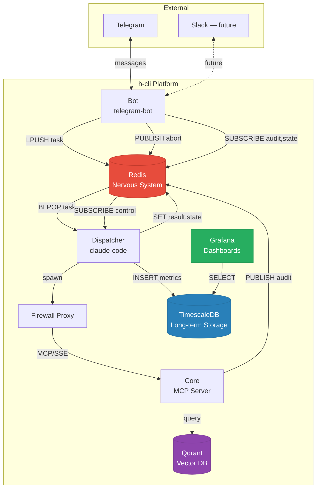
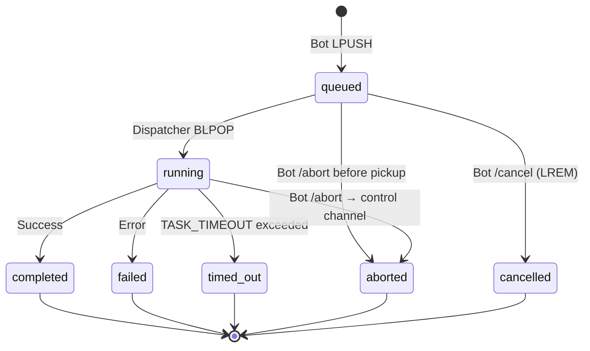
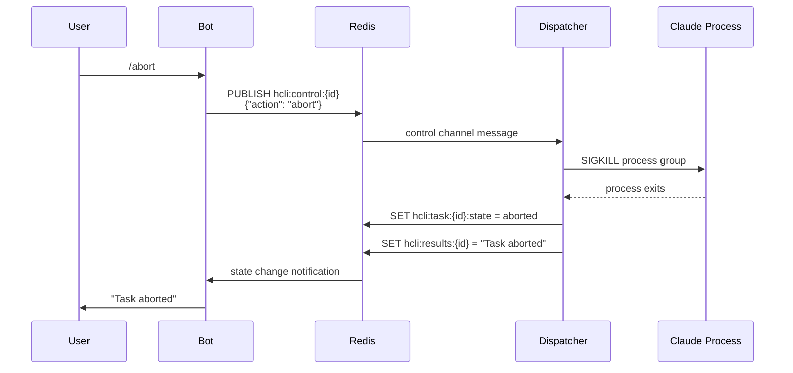
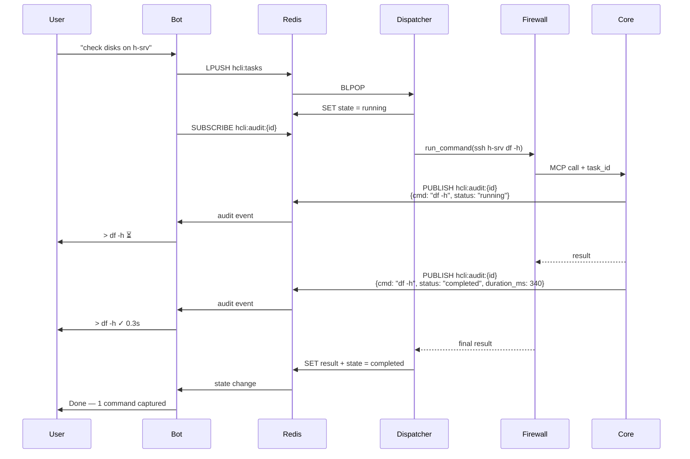
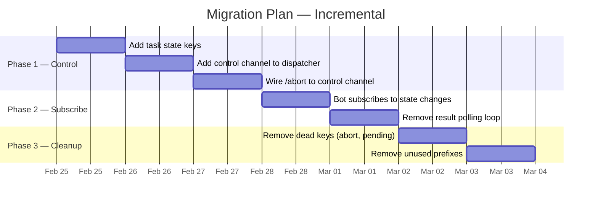

# Proposal: Redis as the Nervous System

**Author**: Architect team
**Date**: 2026-02-24
**Status**: Draft — awaiting operator review

---

## Problem

Redis usage is fragmented. Each component invented its own keys, some publish events nobody subscribes to, some set flags nobody reads. The result:

- `/abort` sets a key — dispatcher never checks it. Task runs until timeout.
- Audit events publish from Core — but only if task_id reaches Core (required infra hack through firewall proxy).
- Session state is split between Redis keys and conversation context injection.
- No task lifecycle — a task is either "in the queue" or "done." No running/failed/aborted state.
- Zombies accumulate because the dispatcher has no way to know a task should die.
- Bot polls for results instead of subscribing.

---

## System Overview



---

## Current Redis Keys

### Bot (telegram-bot)
| Key/Channel | Type | Purpose |
|-------------|------|---------|
| `hcli:tasks` | List | Task queue (LPUSH/BLPOP) |
| `hcli:results:{task_id}` | String | Task result (polled by bot) |
| `hcli:pending:{task_id}` | String | Pending task marker |
| `hcli:abort:{task_id}` | String | Abort signal (SET, **never read**) |
| `hcli:session_history:{chat_id}` | List | Conversation turns |
| `hcli:session_size:{chat_id}` | String | Session byte counter |
| `hcli:stats:{date}` | Hash | Daily usage stats |
| `hcli:teach:{chat_id}` | String | Teach mode flag |
| `hcli:audit:{task_id}` | Channel | Audit event subscription |

### Dispatcher (claude-code)
| Key/Channel | Type | Purpose |
|-------------|------|---------|
| `hcli:tasks` | List | Task queue (BLPOP) |
| `hcli:results:{task_id}` | String | Task result (SET) |
| `hcli:session:{chat_id}` | String | Session ID |
| `hcli:session_size:{chat_id}` | String | Session byte counter |
| `hcli:session_history:{chat_id}` | List | Conversation turns |
| `hcli:memory:{task_id}:{role}` | String | Raw conversation JSON |
| `hcli:last_activity:{chat_id}` | String | Last message timestamp |
| `hcli:stats:{date}` | Hash | Daily usage stats |

### Core (MCP server)
| Key/Channel | Type | Purpose |
|-------------|------|---------|
| `hcli:audit:{task_id}` | Channel | Audit event publishing |

---

## Proposed Architecture

**One rule: everything real-time goes through Redis. Everything historical goes to TimescaleDB. Grafana reads TimescaleDB only.**

```plantuml
@startuml
!theme plain
skinparam backgroundColor #1a1a2e
skinparam defaultFontColor #e0e0e0
skinparam componentStyle rectangle
skinparam ArrowColor #e74c3c

title Redis Nervous System — Data Flow

actor User as user
component "Telegram" as tg #16213e
component "Bot" as bot #16213e
database "Redis" as redis #e74c3c
component "Dispatcher" as disp #16213e
component "Firewall" as fw #16213e
component "Core (MCP)" as core #16213e
database "TimescaleDB" as tsdb #2980b9
component "Grafana" as graf #27ae60
database "Qdrant" as qdrant #8e44ad

user -> tg : message
tg -> bot : webhook
bot -> redis : LPUSH hcli:tasks
redis -> disp : BLPOP hcli:tasks
disp -> fw : spawn subprocess
fw -> core : MCP tool calls
core -> redis : PUBLISH hcli:audit:{id}
redis -> bot : SUBSCRIBE hcli:audit:{id}
bot -> tg : edit message (verbose)
disp -> redis : SET hcli:results:{id}
disp -> redis : SET hcli:task:{id}:state
redis -> bot : SUBSCRIBE hcli:task:{id}:state
bot -> tg : send result

user -> tg : /abort
tg -> bot : command
bot -> redis : PUBLISH hcli:control:{id}
redis -> disp : SUBSCRIBE hcli:control:{id}
disp -> disp : SIGKILL process
disp -> redis : SET state=aborted

disp -> tsdb : INSERT metrics
graf -> tsdb : SELECT dashboards
core -> qdrant : semantic search

@enduml
```



---

## Task Lifecycle



| State | Who sets it | What happens |
|-------|------------|--------------|
| `queued` | Bot | Task pushed to `hcli:tasks`, state key created |
| `running` | Dispatcher | BLPOP picks it up, state updated |
| `completed` | Dispatcher | Result written, state updated |
| `failed` | Dispatcher | Error written, state updated |
| `timed_out` | Dispatcher | Process killed, state updated |
| `aborted` | Bot → Dispatcher | Bot publishes to `hcli:control:{id}`, dispatcher kills process |
| `cancelled` | Bot | Task removed from queue before dispatcher picks it up |

---

## Control Channel — Abort Flow



---

## Audit Stream — Verbose Mode



---

## Redis Key Namespace — Mind Map

```markmap
# hcli: Redis Namespace

## Task Flow
### hcli:tasks
- List (queue)
- Bot writes, Dispatcher reads
- No TTL
### hcli:task:{id}:state
- String (lifecycle)
- queued → running → completed/failed/timed_out/aborted
- TTL: 1h
### hcli:results:{id}
- String (final output)
- Dispatcher writes, Bot reads
- TTL: 1h
### hcli:control:{id}
- Channel (pub/sub)
- Bot publishes abort
- Dispatcher subscribes

## Audit
### hcli:audit:{id}
- Channel (pub/sub)
- Core publishes commands
- Bot subscribes (verbose mode)

## Session
### hcli:session:{chat}
- String (session ID)
- TTL: SESSION_TTL
### hcli:session_size:{chat}
- String (byte counter)
- TTL: SESSION_TTL
### hcli:session_history:{chat}
- List (conversation turns)
- TTL: SESSION_TTL
### hcli:memory:{id}:{role}
- String (raw conversation JSON)
- TTL: SESSION_TTL
### hcli:last_activity:{chat}
- String (timestamp)
- TTL: SESSION_TTL

## User Features
### hcli:stats:{date}
- Hash (daily counters)
- TTL: 48h
### hcli:teach:{chat}
- String (teach mode flag)
- TTL: SESSION_TTL

## Dead Keys (to remove)
### hcli:abort:{id}
- Never read — replace with control channel
### hcli:pending:{id}
- Replace with task state
```

---

## What Changes

### Bot
- `/abort` publishes to `hcli:control:{task_id}` instead of setting a dead key
- `/cancel` removes task from queue (LREM) and sets state to `cancelled`
- Result polling replaced with `SUBSCRIBE hcli:task:{id}:state` — reacts to completion instantly
- `/status` reads task states from Redis instead of guessing

### Dispatcher
- On task pickup: set state to `running`
- Subscribe to `hcli:control:{task_id}` in a thread
- On abort signal: kill process group, set state to `aborted`
- On completion: set state to `completed` or `failed`
- On timeout: set state to `timed_out`
- Reap zombie processes properly

### Core
- No changes. Audit publishing already works.

### TimescaleDB
- Receives completed task metrics (already happens)
- Audit log persistence (already happens)
- No real-time role

### Grafana
- Reads TimescaleDB only
- No Redis dependency

---

## What Does NOT Change

- Grafana and TimescaleDB stay as they are (long-term storage + dashboards)
- MCP architecture (claude-code → firewall → core)
- Skill system
- Session chunking to disk

---

## Migration



Each step is independently deployable. No big bang.

---

## Redis Key Namespace (final)

| Pattern | Type | TTL | Owner |
|---------|------|-----|-------|
| `hcli:tasks` | List | none | Bot writes, Dispatcher reads |
| `hcli:task:{id}:state` | String | 1h | Dispatcher writes, Bot reads |
| `hcli:control:{id}` | Channel | n/a | Bot publishes, Dispatcher subscribes |
| `hcli:audit:{id}` | Channel | n/a | Core publishes, Bot subscribes |
| `hcli:results:{id}` | String | 1h | Dispatcher writes, Bot reads |
| `hcli:session:{chat}` | String | SESSION_TTL | Dispatcher |
| `hcli:session_size:{chat}` | String | SESSION_TTL | Both |
| `hcli:session_history:{chat}` | List | SESSION_TTL | Both |
| `hcli:memory:{id}:{role}` | String | SESSION_TTL | Dispatcher |
| `hcli:stats:{date}` | Hash | 48h | Both |
| `hcli:last_activity:{chat}` | String | SESSION_TTL | Dispatcher |
| `hcli:teach:{chat}` | String | SESSION_TTL | Bot |

---

## Decision needed

**Operator**: Review the diagrams. This is the target state. Migration is incremental — Phase 1 (abort/control channel) solves the highest pain point and can ship independently.
